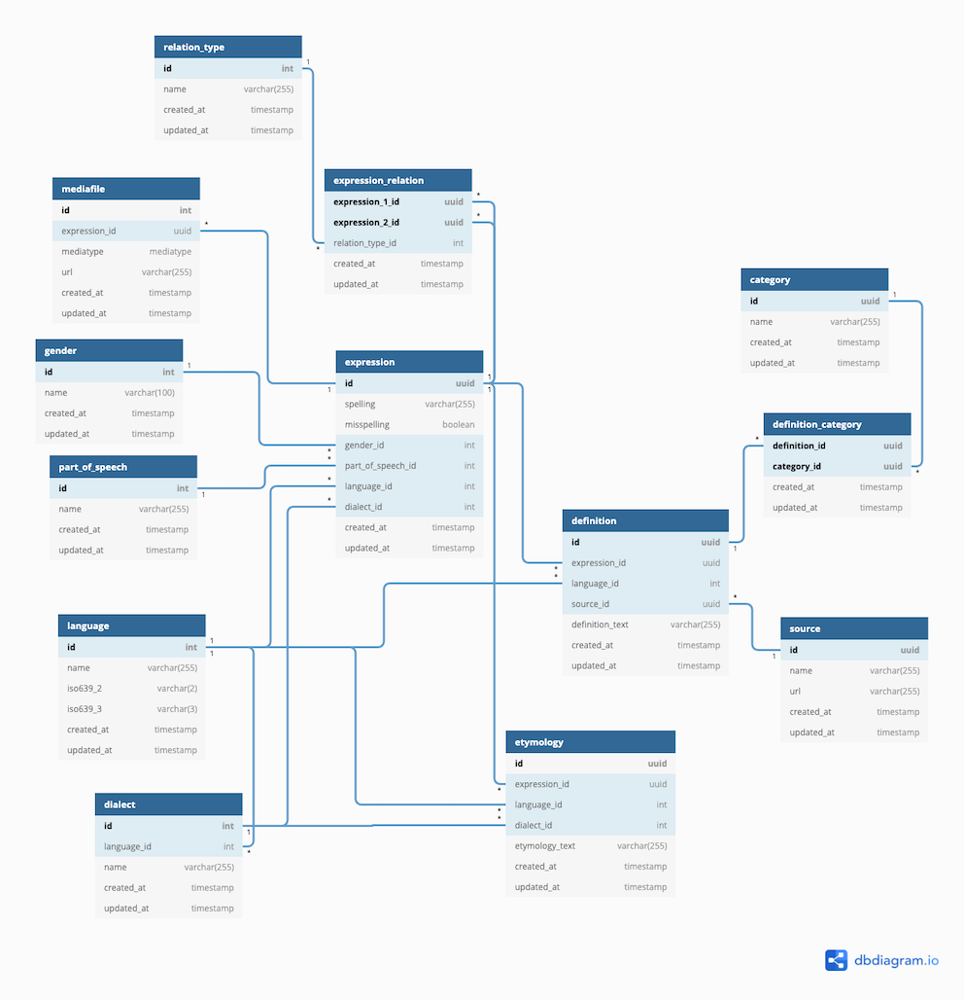

# Модель базы данных Gafalag

Ниже приведено описание модели базы данных описывающую построение словарных статей.

Пример словарной статьи: 
> **гаф (-уни,-уна,-ар)** слово; _**гаф авач**_ или _**вуч гаф ава**_ ничего плохого не скажешь; _**гаф акатун**_ слушаться; исполнять желание, просьбу; _**гаф акъат тавун**_ молчать, не промолвить слова; _**гаф акъудун**_ сказать, промолвить (что-л.); _**гаф гун**_ давать слово, обещать (что-л.); _**гаф юкьвалай атIун**_ прерывать на полуслове; _**чIехидан гаф атIумир**_ погов. не перебивай старшего; _**Ø гафуни атIун**_ иметь авторитет, вес; _**садан гафуна хьун**_ быть на поводу (у кого-л.), быть послушным (кому-л.); _**садан гафунал къугъун**_ играть под чью-либо дудку; _**гафунал гаф эцигун**_ прекословить, перечить, возражать (кому-л.); _**гафунивай тухуз тахьун**_ не лезть за словом в карман, быть находчивым; _**ам гафунивай тухуз жедайди туш**_ он находчивый, такой, что за словом в карман не лезет; см. тж. _**келима; гафунай**_ к примеру; скажем; _**гафарай кьацIар акъудун**_ придираться к словам

Каждая строка в таблице `expression` содержит данные о заглавной единицы(заглавном слове) словарной статьи, таким образом таблица `expression` образует левую часть словаря - словник

Правая же сторона словаря состоит из совокупности таблиц:

- `definition` - описательное толкование слова с цитатами, типом значения итд.
- `source` - указывает на источник откуда была взята информация
- `relation_type` + `expression_relation` + `expression` - указывает связи между словами такие как синонимы, антонимы, омонимы и тд.
- `part_of_speech` - указывает на часть речи к которой относится слово **[!Следует проверить надобность связи таблицы с `expression` или с `definition`]**
- `gender` - описывает род слова либо его отсутствие
- `etymology` - объясняет происхождение слова
- `mediafile` - ссылка на аудио, фото либо иной формат медиа файла описывающего слово
- `category` + `definition_category` - категория к которой относится значение слова, к примеру медицина, IT, авиация и тд.
- `language` - язык к которому относится слово
- `dialect` - диалект языка в котором используется это слово

## expression

Образует левую часть словаря - словник

|  Name  |  Type  |  Settings  |  Default value  |  References  |  Note  |
|----------|----------|----------|----------|----------|----------|
|  id  |  uuid  |  PK,   |    |  mediafile.expression_id, expression_relation.expression_1_id, expression_relation.expression_2_id, definition.expression_id, etymology.expression_id  |    |
|  spelling  |  varchar(255)  |  NOT NULL, UNIQUE  |    |    |    |
|  misspelling  |  boolean  |    |  false  |    |  Is expression misspelled  |
|  gender_id  |  int  |    |    |  gender.id  |    |
|  part_of_speech_id  |  int  |    |    |  part_of_speech.id  |    |
|  language_id  |  int  |  NOT NULL,   |    |  language.id  |    |
|  dialect_id  |  int  |    |    |  dialect.id  |    |
|  created_at  |  timestamp  |    |    |    |    |
|  updated_at  |  timestamp  |    |    |    |    |

## gender

Описывает род слова либо его отсутствие

|  Name  |  Type  |  Settings  |  Default value  |  References  |  Note  |
|----------|----------|----------|----------|----------|----------|
|  id  |  int  |  PK,   |    |  expression.gender_id  |    |
|  name  |  varchar(100)  |  NOT NULL, UNIQUE  |    |    |    |
|  created_at  |  timestamp  |    |    |    |    |
|  updated_at  |  timestamp  |    |    |    |    |

## part_of_speech

Указывает на часть речи к которой относится слово

**[!Следует проверить надобность связи таблицы с `expression` или с `definition`]**

|  Name  |  Type  |  Settings  |  Default value  |  References  |  Note  |
|----------|----------|----------|----------|----------|----------|
|  id  |  int  |  PK,   |    |  expression.part_of_speech_id  |    |
|  name  |  varchar(255)  |  NOT NULL, UNIQUE  |    |    |    |
|  created_at  |  timestamp  |    |    |    |    |
|  updated_at  |  timestamp  |    |    |    |    |

## language

Язык к которому относится слово

|  Name  |  Type  |  Settings  |  Default value  |  References  |  Note  |
|----------|----------|----------|----------|----------|----------|
|  id  |  int  |  PK,   |    |  expression.language_id, dialect.language_id, definition.language_id, etymology.language_id  |    |
|  name  |  varchar(255)  |  NOT NULL, UNIQUE  |    |    |    |
|  iso639_2  |  varchar(2)  |  UNIQUE  |    |    |    |
|  iso639_3  |  varchar(3)  |    |    |    |    |
|  created_at  |  timestamp  |    |    |    |    |
|  updated_at  |  timestamp  |    |    |    |    |

## dialect

Диалект языка в котором используется это слово

|  Name  |  Type  |  Settings  |  Default value  |  References  |  Note  |
|----------|----------|----------|----------|----------|----------|
|  id  |  int  |  PK,   |    |  expression.dialect_id, etymology.dialect_id  |    |
|  language_id  |  int  |  NOT NULL,   |    |  language.id  |    |
|  name  |  varchar(255)  |  NOT NULL, UNIQUE  |    |    |    |
|  created_at  |  timestamp  |    |    |    |    |
|  updated_at  |  timestamp  |    |    |    |    |

## mediafile

Ссылка на аудио, фото либо иной формат медиа файла описывающего слово

|  Name  |  Type  |  Settings  |  Default value  |  References  |  Note  |
|----------|----------|----------|----------|----------|----------|
|  id  |  int  |  PK,   |    |    |    |
|  expression_id  |  uuid  |  NOT NULL,   |    |  expression.id  |    |
|  mediatype  |  mediatype  |  NOT NULL,   |    |    |    |
|  url  |  varchar(255)  |  NOT NULL,   |    |    |    |
|  created_at  |  timestamp  |    |    |    |    |
|  updated_at  |  timestamp  |    |    |    |    |

## expression_relation

`relation_type` + `expression_relation` + `expression` - указывает связи между словами такие как синонимы, антонимы, омонимы и тд.

|  Name  |  Type  |  Settings  |  Default value  |  References  |  Note  |
|----------|----------|----------|----------|----------|----------|
|  expression_1_id  |  uuid  |  NOT NULL,   |    |  expression.id  |    |
|  expression_2_id  |  uuid  |  NOT NULL,   |    |  expression.id  |    |
|  relation_type_id  |  int  |  NOT NULL,   |    |  relation_type.id  |    |
|  created_at  |  timestamp  |    |    |    |    |
|  updated_at  |  timestamp  |    |    |    |    |

## relation_type

`relation_type` + `expression_relation` + `expression` - указывает связи между словами такие как синонимы, антонимы, омонимы и тд.

|  Name  |  Type  |  Settings  |  Default value  |  References  |  Note  |
|----------|----------|----------|----------|----------|----------|
|  id  |  int  |  PK,   |    |  expression_relation.relation_type_id  |    |
|  name  |  varchar(255)  |  NOT NULL, UNIQUE  |    |    |    |
|  created_at  |  timestamp  |    |    |    |    |
|  updated_at  |  timestamp  |    |    |    |    |

## definition_category

`category` + `definition_category` - категория к которой относится значение слова, к примеру медицина, IT, авиация и тд.

|  Name  |  Type  |  Settings  |  Default value  |  References  |  Note  |
|----------|----------|----------|----------|----------|----------|
|  definition_id  |  uuid  |  NOT NULL,   |    |  definition.id  |    |
|  category_id  |  uuid  |  NOT NULL,   |    |  category.id  |    |
|  created_at  |  timestamp  |    |    |    |    |
|  updated_at  |  timestamp  |    |    |    |    |

## category

`category` + `definition_category` - категория к которой относится значение слова, к примеру медицина, IT, авиация и тд.

|  Name  |  Type  |  Settings  |  Default value  |  References  |  Note  |
|----------|----------|----------|----------|----------|----------|
|  id  |  uuid  |  PK,   |    |  definition_category.category_id  |    |
|  name  |  varchar(255)  |  NOT NULL, UNIQUE  |    |    |    |
|  created_at  |  timestamp  |    |    |    |    |
|  updated_at  |  timestamp  |    |    |    |    |

## definition

Описательное толкование слова с цитатами, типом значения итд.

|  Name  |  Type  |  Settings  |  Default value  |  References  |  Note  |
|----------|----------|----------|----------|----------|----------|
|  id  |  uuid  |  PK,   |    |  definition_category.definition_id  |    |
|  expression_id  |  uuid  |  NOT NULL,   |    |  expression.id  |    |
|  language_id  |  int  |  NOT NULL,   |    |  language.id  |    |
|  source_id  |  uuid  |  NOT NULL,   |    |  source.id  |    |
|  definition_text  |  varchar(255)  |  NOT NULL, UNIQUE  |    |    |    |
|  created_at  |  timestamp  |    |    |    |    |
|  updated_at  |  timestamp  |    |    |    |    |

## source

Указывает на источник откуда была взята информация

|  Name  |  Type  |  Settings  |  Default value  |  References  |  Note  |
|----------|----------|----------|----------|----------|----------|
|  id  |  uuid  |  PK,   |    |  definition.source_id  |    |
|  name  |  varchar(255)  |  NOT NULL, UNIQUE  |    |    |    |
|  url  |  varchar(255)  |  NOT NULL,   |    |    |    |
|  created_at  |  timestamp  |    |    |    |    |
|  updated_at  |  timestamp  |    |    |    |    |

## etymology

Объясняет происхождение слова

|  Name  |  Type  |  Settings  |  Default value  |  References  |  Note  |
|----------|----------|----------|----------|----------|----------|
|  id  |  uuid  |  PK,   |    |    |    |
|  expression_id  |  uuid  |  NOT NULL,   |    |  expression.id  |    |
|  language_id  |  int  |  NOT NULL,   |    |  language.id  |    |
|  dialect_id  |  int  |    |    |  dialect.id  |    |
|  etymology_text  |  varchar(255)  |  NOT NULL, UNIQUE  |    |    |    |
|  created_at  |  timestamp  |    |    |    |    |
|  updated_at  |  timestamp  |    |    |    |    |